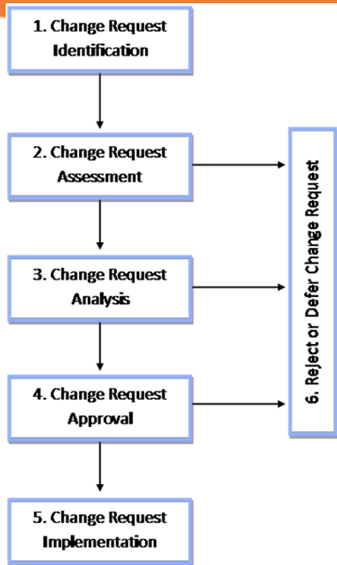

# Introduction

A change is nothing more than a transition from one state to another, or from the current state to a desired future state.

Change management is the use of a well-defined procedure and a set of instruments to guide change on the human side and bring about the desired result.

As part of this assignment, I will make some changes to my database using change management, a methodical approach to managing the transition or transformation of the goals, practices, or technologies associated with my database project. The objective of change management is to implement methods for bringing about change, managing change, and attempting to adapt to change.

Over the past twenty-five years, the discipline of change management has grown and developed. According to Prosci research, changes won't be successful without the adoption.

There are processes for the change, and the figure below provides an example.

<figure><figcaption></figcaption></figure>
