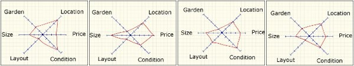
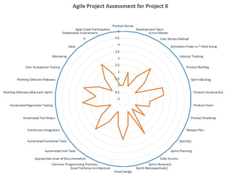
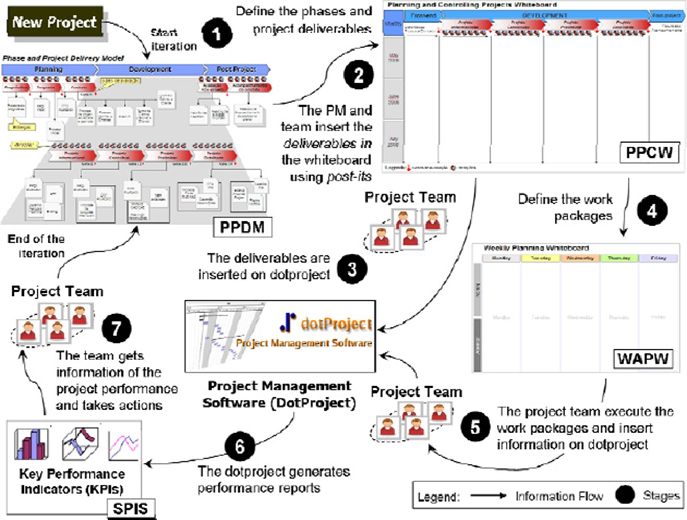
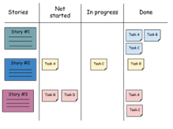
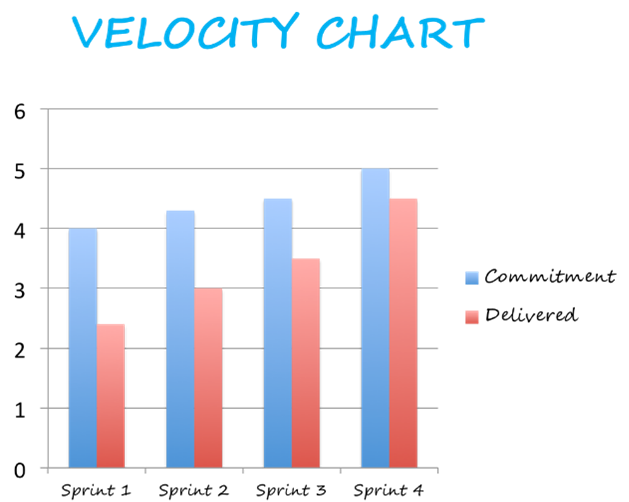

# Agile (M\&E)

Evaluation of Agile is different from Waterfall as Agile gets evaluated after each increment ends, which means Agile has multiple evaluations.

There are so many tools that can be used however, (scrumandkanban.co.uk, 2014) recommended star-plots and says that star-plots have been around since the 1800s and a lot of managers in Agile use this scale for their projects.

<figure><figcaption></figcaption></figure>

Or another tool is radar-chart it’s a graph that merely displays 34 assessment items on a rating scale of 1 (worst) to 5 (organized into 7 assessment areas). (linkedin.com, 2016)

<figure><figcaption></figcaption></figure>

Well-known techniques like scrum or Kanban will be used by project-managers in charge of an agile methodology project to keep track of their projects. to ensure that each task is graphically represented for the benefit of the whole team. The projects make use of visual resources like velocity-charts and task-boards.

<figure><figcaption></figcaption></figure>

system for organizing and monitoring. (pmi.org, 2022)

So, monitoring:

·        Tools like the task-board and velocity-chart.

·        Each project stage is represented visually on the task-board.

·        Agile monitoring is a more straightforward method of tracking and ​greater impact on the customer's experience

·        Progress during a sprint can be measured in three different ways.

1\.     The number of tasks completed ​

2\.     Approximate Efforts

3\.     The total number of points earned

What exactly (Key Performance Indication) KPI in Agile? The concept is an Agile team utilizes precise metrics to monitor success throughout each iteration or sprint. These indicators are utilized in strategic planning to influence the next iteration's path. Agile, as the name implies, is a fast-paced environment.

<figure><figcaption>
  (manifesto.co.uk, 2022) 
</figcaption></figure>

&#x20;  &#x20;

<figure><figcaption>
  (www.agile-scrum.be, 2022)
</figcaption></figure>

&#x20;

| **Advantages**                                                   | **Dis-Advantages**                                                          |
| ---------------------------------------------------------------- | --------------------------------------------------------------------------- |
| Changes are possible                                             | Difficult decisions to hire more people because Insufficient documentations |
| More interactions with customers                                 | Insufficient documentation                                                  |
| Saves resources                                                  | For long projects                                                           |
| Information is transferred in an efficient and effective manner. | Team may find it more demanding.                                            |
