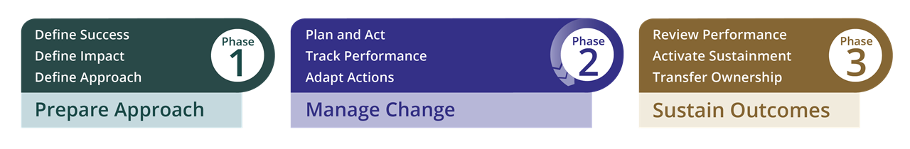
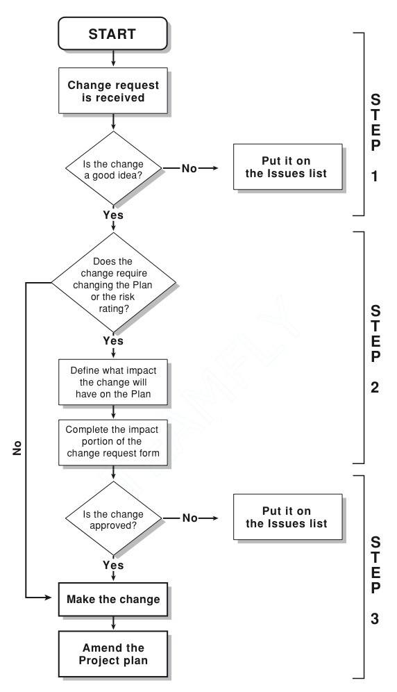
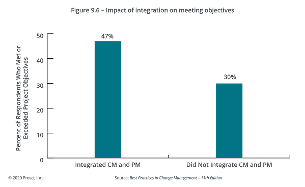

# Change Management Research

It's important to bring up the change management process, which can be broken down into three phases:

&#x20;

Phase 1: Prepare Approach questions and answers

&#x20;

What are we trying to achieve?

Who must carry out their tasks in a different way, and how?

What are the requirements for success?

&#x20;

Phase 2: Manage Change asks and responds to the following:

&#x20;

What actions are we going to take to involve, assist, and prepare the public?

How are we doing?

What adjustments are required?

&#x20;

And in Phase 3 - Sustain Outcomes, we enquire into and respond to:

&#x20;

Now, where are we? Are we done at this point?

What is necessary to ensure that the change endures?

Who will assume accountability and uphold the outcomes?

<figure><figcaption>
<strong>(PROSCI, 2022)</strong>
</figcaption></figure>

The process broken into three steps and this one is taken from ["Getting Started in Project Management" by Martin and Tate.](https://www.amazon.com/Getting-Started-Project-Management-Karen/dp/0471135038) I've also added some data and illustrations about the steps.

&#x20;

1. Request

Someone from the project team or from another group makes a change request. A change-request form's justification section has been finished. The project team determines whether the change is necessary. If the requested modification makes sense, they move on to step two. If the requested change is unreasonable, the problem is noted on the issues list and discussed with the sponsor and the requester.

&#x20;2\. Impact

The team evaluates the impact of the change request on the project. The originator, customer, and sponsor all review the impact analysis.

&#x20;

3\. Denial/Approval

The customer and sponsor either accept or reject the change request. The requester is informed if the change request is rejected. The project plan is modified, and the requester and team are informed upon approval of the change request.

A change must receive approval from the requester, project leader, sponsor, and customer before it can be put into effect. Any additional approvals that are required should be noted on the form.

&#x20;

<figure><figcaption>
(PM Tips , 2022)
</figcaption></figure>

I’ll need (Integrating Change Management and Project Management) in the change description according to (PROSCI, 2022) integration creates value

* Creating a shared objective
* Enabling a more proactive approach
* Improving sequencing and alignment
* Enhancing information exchange

<figure><figcaption>
(PROSCI, 2022)
</figcaption></figure>

Both project management and change management are disciplines that support the success of my database project. The database benefits of the change are ensured by integrating these disciplines throughout the project's lifecycle because the technical and human aspects of the change are intertwined.

&#x20;
