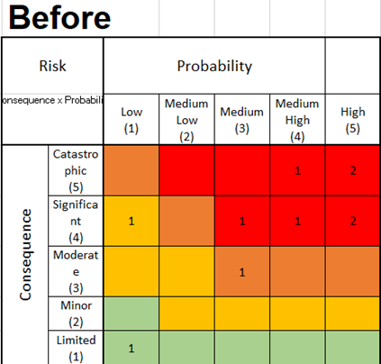

# Cost per Resource

| 
Team_Members

 
             | 
Est.Hours

 
 | 
€/Hr

 
 | 
Subtotal

 
 |                               |                                  |
| --------------------------------------- | ------------------------ | ------------------- | ----------------------- | ----------------------------- | -------------------------------- |
| Product\_Manager\_(1)                   | 258                      | 50                  | 12,900                  |                               |                                  |
| Hardware\_Developer\_(3)                | 600                      | 80                  | 48,000                  |                               |                                  |
| Java\_Developer\_(5)                    | 1200                     | 80                  | 96,000                  |                               |                                  |
| Finance\_Team\_(2)                      | 500                      | 120                 | 60,000                  |                               |                                  |
| Design\_team\_(3)                       | 240                      | 120                 | 28,800                  |                               |                                  |
| Web\_developer\_(5)                     | 1000                     | 80                  | 80,000                  |                               |                                  |
| Database\_admin\_(1)                    | 258                      | 100                 | 25,800                  |                               |                                  |
| Project\_manager\_(1)                   | 258                      | 80                  | 20,640                  |                               |                                  |
| Customer\_Relationship\_Management\_(4) | 400                      | 50                  | 20,000                  |                               |                                  |
| Total:                                  |                          |                     | 392,140                 |                               |                                  |
|                                         |                          |                     |                         | 
Contingency%20

 
 | 
GRAND_TOTAL

470,568
 |

We can see the difference in this table by evaluating the effectiveness of a project, listing the team members and their roles is a metric! it is true that the table above is about building a website but what I find interesting is that this metric can be used to compare the cost-effectiveness of different projects also, simply by dividing the project’s total cost by the number of resources used.

It’s nice to mention that this is bottom-up since we are building from the ground up, trying to get as many details as possible, and down below image explains why this is bottom-up.

<figure><figcaption>
(Kimberlee Meier, 2020)
</figcaption></figure>

