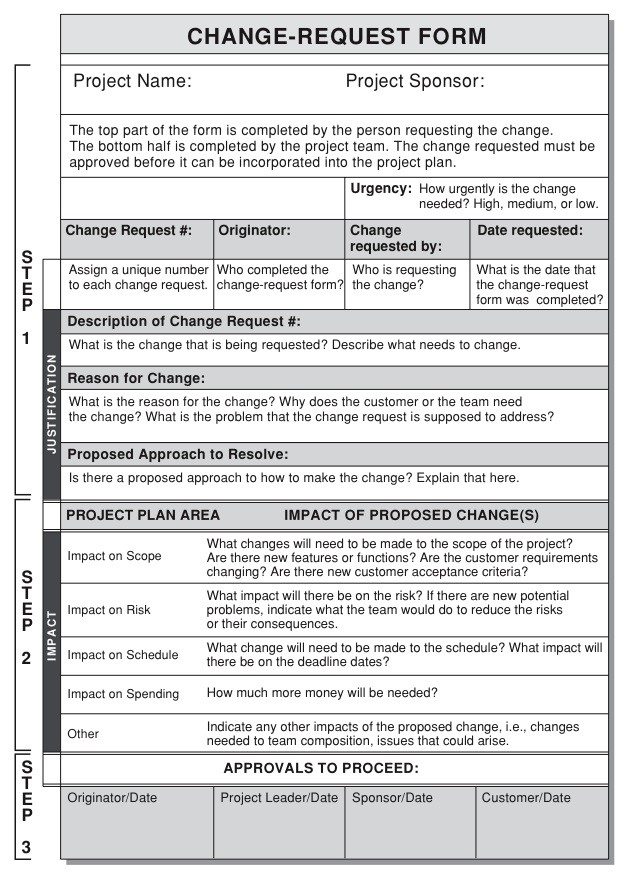

# Suggested Change

The suggested change is: the customers can change their password. Change-request should be made about updating the variable holdings in the database. The change-request justification form section (Figure below) should be finished, and then the change request should be looked at and evaluated if it makes sense or not (Approval or denial).

<figure><figcaption>
(PM Tips , 2022)
</figcaption></figure>
