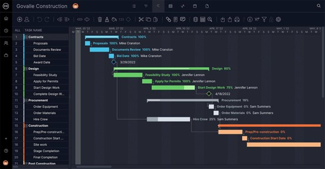

# Waterfall (M\&E)

It’s simple to monitor progress by laying out a waterfall-project in a Gantt-chart. The timeline functions as a progress bar, making it always clear what stage a project is in.

According to research, flow-chart or Gantt-chart is the best way to characterize waterfall. How the prior phase "falls" into the following phase is characterized in a Gantt-chart.

&#x20;

<figure><figcaption>
(venngage, 2022)
</figcaption></figure>

The project-manager used the five sets of stages—requirements definition, design, execution, verification, and deployment—to create a clear work structure also following the Prince 2 principles. It has a distinct requirement, which helps to guarantee constant quality because it has been established from the beginning. Let’s ask questions,

Who looks at the metrics?

The project manager keeps an eye on the metrics.

Who actions the follow-up?

Project-manager who follows up is necessary because they are the ones who divide the team members' tasks into work packages.

| **Advantages**                                              | **Dis-Advantages**                              |
| ----------------------------------------------------------- | ----------------------------------------------- |
| Tasks completion is good to keep the team members on track. | Changing is difficult.                          |
| Quality oriented                                            | Project might fail if doesn’t meet the criteria |
| Saves resources                                             | lot of documentations                           |

&#x20;

The evaluation: the Manager's summary of the project's overall performance as an evaluation of the results of the actual results in comparison to the anticipated results. Reviewing issue and risk statistics can help future projects, save money and resources, and improve team performance.
